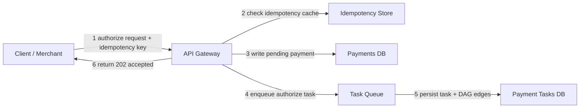
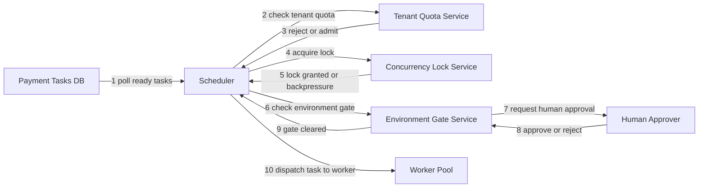
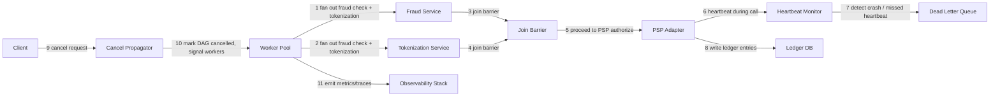
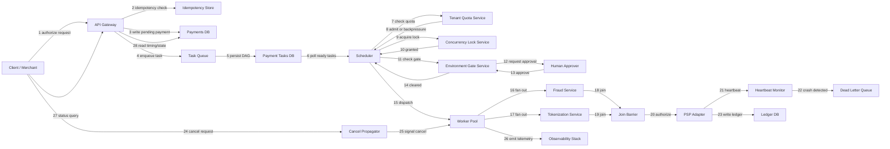

# Distributed Payment System — Staff-Level System Design Study Notes

---

## 1. Requirements

### Functional Requirements

| # | Requirement | One-liner |
|---|---|---|
| 1 | Payment Authorization | Reserve funds on a customer's payment instrument via a PSP without capturing them |
| 2 | Capture | Convert an authorization into an actual funds movement, full or partial |
| 3 | Refunds | Reverse a prior capture, fully or partially, back to the original instrument |
| 4 | Ledger & Reconciliation | Maintain an immutable double-entry ledger and reconcile against PSP/bank statements |
| 5 | Idempotent Processing | Guarantee exactly-once effect for retried client requests using idempotency keys |
| 6 | Fraud Screening | Score every authorization request in real time before it reaches a PSP |
| 7 | Cancel / Re-run | Allow cancellation of in-flight payment workflows and re-run of only failed steps |

### Non-Functional Requirements

| # | Requirement | Target Metric |
|---|---|---|
| 1 | Availability | 99.99% for authorization path |
| 2 | Latency | p99 < 500ms for authorize, < 200ms for status read |
| 3 | Durability | Zero ledger data loss, RPO = 0 |
| 4 | Consistency | Strong consistency on ledger writes, eventual on reporting views |
| 5 | Throughput | Sustain 20,000 TPS at peak with burst to 40,000 TPS |
| 6 | Tenant Isolation | Noisy-neighbor blast radius limited to a single tenant |
| 7 | Auditability | 7-year immutable audit trail, PCI DSS scope minimized |

> "Before I size anything, let's agree on the contract: we need strong consistency on money movement, sub-second authorization latency, and a system that never silently loses a ledger entry — everything else is negotiable, that isn't."

---

## 2. Back-of-the-Envelope Estimation

```
Assumptions:
- 20,000 payment requests/sec average, peak burst 40,000/sec
- Each payment event (auth, capture, refund, ledger entry) ~ 2 KB serialized
- Each transaction generates ~4 records: auth, capture, ledger debit, ledger credit

Requests/sec:
  Avg: 20,000 req/s
  Peak: 40,000 req/s

Storage/day:
  20,000 req/s * 86,400 s/day = ~1.73B transactions/day
  1.73B * 4 records * 2 KB = ~13.8 TB/day raw
  With 3x replication: ~41.4 TB/day written
  Retained 7 years (2,555 days) but cold-tiered after 90 days:
    Hot (90 days): 13.8 TB/day * 90 = ~1.24 PB hot storage
    Cold (remaining ~7yrs): compressed ~5x -> ~2.76 KB/record equivalent -> manageable in object storage (~10s of PB, archival tier)

Bandwidth:
  Avg payload 2 KB, 20,000 req/s = 40 MB/s inbound
  With PSP round-trips (2x) and ledger fan-out (4x) -> ~240 MB/s aggregate internal bandwidth
  Peak (40,000 req/s) -> ~480 MB/s

Peak concurrency (in-flight requests):
  p99 latency 500ms, peak 40,000 req/s
  Little's Law: concurrency = arrival_rate * latency = 40,000 * 0.5s = 20,000 in-flight requests

Instance count (authorization service):
  Each instance handles ~500 req/s comfortably (I/O bound, PSP calls)
  Peak 40,000 req/s / 500 req/s per instance = 80 instances
  Add 50% headroom for failover/rolling deploys -> ~120 instances

Ledger DB shards:
  Target 5,000 writes/sec per shard (durable, replicated writes)
  40,000 req/s * 2 ledger rows / 5,000 = 16 shards, round up to 20 for headroom
```

> "These numbers aren't precise, they're directional — the point is to show I know ledger writes dominate storage, PSP round-trips dominate latency, and concurrency sizing comes straight from Little's Law."

---

## 3. API Endpoints

| Method | Endpoint | Description |
|---|---|---|
| POST | `/v1/payments/authorize` | Create an authorization (external, idempotency-key required) |
| POST | `/v1/payments/{id}/capture` | Capture a previously authorized payment, full or partial |
| POST | `/v1/payments/{id}/refund` | Refund a captured payment, full or partial |
| GET | `/v1/payments/{id}` | Get payment status with `started_at`, `completed_at`, current state |
| GET | `/v1/payments` | List payments for a tenant (paginated, filterable by state/date) |
| POST | `/v1/payments/{id}/cancel` | Cancel an in-flight payment workflow |
| POST | `/v1/payments/{id}/rerun` | Re-run only the failed subtasks of a payment workflow |
| GET | `/v1/gates/{gate_id}` | Get pending approval gate details |
| POST | `/v1/gates/{gate_id}/approve` | Human approval to proceed past a sensitive-operation gate |
| POST | `/v1/gates/{gate_id}/reject` | Human rejection, halts and rolls back the workflow |
| GET | `/v1/ledger/entries` | Query ledger entries for reconciliation |
| POST | `/internal/v1/psp/callback` | PSP webhook callback (internal, signed & verified) |
| POST | `/internal/v1/worker/lease` | Worker leases next available task (pull-based) |
| POST | `/internal/v1/worker/{task_id}/heartbeat` | Worker heartbeat to extend visibility timeout |
| POST | `/internal/v1/worker/{task_id}/complete` | Worker reports task completion/failure |
| GET | `/internal/v1/registry/{workflow_type}` | Fetch cached workflow/schema definition |

---

## 4. Database Tables

**payments** (core entity)
- id (PK)
- tenant_id (FK -> tenants)
- idempotency_key
- amount
- currency
- state
- psp_reference
- started_at
- completed_at

**payment_tasks** (DAG nodes: authorize, fraud_check, capture, ledger_write, notify)
- id (PK)
- payment_id (FK -> payments)
- task_type
- state
- attempt_count
- started_at
- completed_at

**task_dependencies** (DAG edges)
- id (PK)
- payment_id (FK -> payments)
- upstream_task_id (FK -> payment_tasks)
- downstream_task_id (FK -> payment_tasks)

**concurrency_locks**
- id (PK)
- lock_key (e.g. `tenant:{id}:prod_deploy`, `payment:{id}:capture`)
- holder_id
- acquired_at
- expires_at

**environments**
- id (PK)
- name (e.g. sandbox, staging, prod-psp-live)
- requires_approval (bool)

**approval_reviews**
- id (PK)
- gate_id
- payment_id (FK -> payments)
- environment_id (FK -> environments)
- reviewer_id
- decision
- decided_at

**tenant_quotas**
- id (PK)
- tenant_id (FK -> tenants)
- max_tps
- current_usage
- window_started_at

**ledger_entries**
- id (PK)
- payment_id (FK -> payments)
- account_id
- direction (debit/credit)
- amount
- created_at (immutable, append-only)

### Key Indexes

| Index | Reason |
|---|---|
| `payments(tenant_id, state, started_at)` | Fast tenant-scoped listing and dashboarding |
| `payments(idempotency_key)` unique | Enforce exactly-once on retried requests |
| `payment_tasks(payment_id, state)` | Fast lookup of pending/failed subtasks for re-run |
| `task_dependencies(downstream_task_id)` | Efficient join-barrier readiness checks |
| `concurrency_locks(lock_key)` unique | Enforce mutual exclusion at the DB layer |
| `ledger_entries(payment_id)` | Reconciliation and audit queries |
| `ledger_entries(account_id, created_at)` | Statement generation per account |

---

## 5. Design Diagrams — 3 Progressive Sections

### Section 1: Ingestion / Write Path / Storage



> "A client sends an authorize request with an idempotency key. The gateway first checks the idempotency store — if we've seen this key before, we return the cached result instead of double-charging. Otherwise we write a pending payment row, enqueue the first task, persist the DAG skeleton, and return a 202 immediately so the client isn't blocked on downstream PSP latency."

**New components introduced:**
- **API Gateway** — solves request validation, auth, and idempotency-key routing at the edge; without it, every service would re-implement idempotency checks inconsistently.
- **Idempotency Store** — solves duplicate-charge prevention on client retries; without it, network retries could cause double authorization.
- **Payments DB** — solves durable source-of-truth for payment state; without it, we have no recoverable record if a downstream step crashes.
- **Task Queue** — solves decoupling ingestion from processing; without it, a slow PSP call blocks the client-facing request thread.
- **Payment Tasks DB** — solves durable DAG/task tracking for start/stop timing; without it, we can't know which subtasks succeeded and which need re-running.

---

### Section 2: Scheduling, Concurrency Control, Quota Enforcement, Environment Gates

*(Builds on Section 1)*



> "Once a task is ready, the scheduler first asks the tenant quota service whether this tenant has budget left in the current window — if not, we backpressure rather than starve other tenants. Next it acquires a concurrency lock, for example only one live PSP settlement job per tenant at a time. Then, if this task touches a sensitive environment like the production PSP, it blocks on a human approval gate before dispatching to a worker."

**New components introduced:**
- **Scheduler** — solves fair, quota-aware task dispatch; without it, tasks would run first-come-first-served and one tenant could starve others.
- **Tenant Quota Service** — solves per-tenant rate limiting with overflow handling; without it, a single noisy tenant could exhaust shared capacity.
- **Concurrency Lock Service** — solves mutual exclusion for conflicting operations like simultaneous settlement runs; without it, we'd get double-settlement or race conditions on the ledger.
- **Environment Gate Service** — solves inserting mandatory human approval before sensitive operations like live PSP capture; without it, a bad deploy or bug could move real money with no human checkpoint.

---

### Section 3: Parallel Execution, DAG Progression, Cancel Propagation, Failure Handling, Observability

*(Builds on Sections 1 and 2)*



> "The worker fans out fraud scoring and tokenization in parallel since they're independent, then a join barrier waits for both before proceeding to the PSP call — that's true parallelism, not sequential-only execution. While the PSP call is in flight, a heartbeat monitor watches for crashed workers and routes stuck tasks to a dead letter queue. If the client cancels, the cancel propagator marks the DAG cancelled and signals all in-flight workers to stop, so we never keep charging after a cancel. Every step emits metrics and traces."

**New components introduced:**
- **Fraud Service** and **Tokenization Service** — solve independent, parallelizable pre-authorization checks; without parallel fan-out, sequential execution would double this leg's latency.
- **Join Barrier** — solves safely proceeding only after all parallel branches finish; without it, we might authorize before fraud screening completes.
- **PSP Adapter** — solves abstracting multiple external payment processors behind one interface; without it, every service would need PSP-specific logic.
- **Heartbeat Monitor** — solves detecting crashed or stuck workers; without it, a dead worker's task would hang forever with no recovery.
- **Dead Letter Queue** — solves isolating tasks that repeatedly fail so they don't block the pipeline; without it, poison tasks would be retried forever, wasting capacity.
- **Cancel Propagator** — solves stopping in-flight work safely and idempotently; without it, cancelling client-side wouldn't stop server-side charges.
- **Observability Stack** — solves visibility into latency, errors, and stuck DAGs; without it, incidents go undetected until customers complain.

---

## 6. Final Combined Diagram



### Step Legend

| Step Range | Description |
|---|---|
| 1–5 | Ingestion: idempotency check, durable write, task enqueue, DAG persisted |
| 6–14 | Scheduling: quota enforcement, concurrency locking, environment approval gate |
| 15–20 | Parallel execution: fan-out to fraud + tokenization, join barrier, PSP authorize |
| 21–23 | Reliability: heartbeat/crash detection, dead letter queue, ledger write |
| 24–26 | Cancellation and observability propagation across workers |
| 27–28 | Status read path exposing start/stop timing to the client |

---

## 7. Deep Dive: Key Design Decisions

**Pull-based leasing over push-based dispatch**

> "I chose pull-based task leasing with visibility timeouts instead of pushing tasks to workers, because it naturally load-balances across a heterogeneous worker fleet and survives worker crashes — an un-acked lease just expires and becomes claimable again. The trade-off is added polling latency and the need to tune the visibility timeout carefully, since too short causes duplicate processing and too long delays recovery."

**Idempotency keys plus append-only ledger for exactly-once effect**

> "Since PSPs and networks can retry, I made every mutating endpoint idempotent via a client-supplied key, and I made the ledger append-only rather than mutable, so replays are naturally absorbed as no-ops. The trade-off is extra storage for idempotency records and reconciliation logic to collapse duplicate ledger writes that slip through a race window."

**Separate concurrency lock service instead of DB-level row locks**

> "I externalized mutual exclusion into a dedicated lock service with explicit lock keys like tenant-scoped deploy locks, rather than relying purely on database row locks, because it lets me express business-level exclusion — like one settlement job per tenant — that doesn't map cleanly to a single row. The trade-off is another stateful service to operate and a potential single point of contention if not sharded well."

**Environment approval gates as first-class workflow state, not side-channel**

> "I modeled approval gates as an explicit DAG node with its own state machine rather than an out-of-band manual step, because that makes the pending approval visible in the same status API and audit trail as everything else. The trade-off is added workflow complexity, since the scheduler must know how to pause and resume around a gate."

**Strong consistency for ledger, eventual consistency for read replicas**

> "I chose strong consistency and synchronous replication for ledger writes because money can't be eventually consistent, but I let reporting and dashboard reads run off asynchronously replicated views. The trade-off is that dashboards can lag by seconds, which is acceptable, but write latency on the ledger path is higher than a purely eventually consistent system."

**Tenant quotas enforced at the scheduler, not the API gateway**

> "I enforce tenant quotas at the scheduler rather than at the API gateway, because the gateway only sees request rate, not actual resource consumption or downstream PSP capacity, so scheduler-level enforcement lets us backpressure based on real system load. The trade-off is that a misbehaving tenant can still burst past the gateway before being throttled downstream, so I added a lightweight rate limit at the edge too as a first line of defense."

---

## 8. Follow-Up Questions & Answers

> **Q: What happens if the PSP call succeeds but our system crashes before recording it?**
> "This is the classic dangling-authorization problem. We rely on the PSP's own idempotency key and a reconciliation job that periodically polls PSP transaction status for any payment stuck in an in-flight state past a timeout, then reconciles it to the correct terminal state rather than blindly retrying."

> **Q: Where's the scaling bottleneck likely to appear first?**
> "The ledger write path, because it demands strong consistency and durability, which caps throughput per shard. We horizontally shard the ledger by account ID and keep authorization and fraud scoring, which are more parallelizable, on separate scaling tiers."

> **Q: What's the core trade-off in this design?**
> "Strong consistency on money movement versus latency and availability. We accept higher write latency on the ledger to guarantee correctness, and we push everything that can tolerate eventual consistency, like dashboards, off that critical path."

> **Q: How do you isolate tenants from each other?**
> "Every task carries a tenant ID that's checked at the quota service, the lock service, and the ledger layer, so one tenant's spike triggers backpressure scoped to them alone. We also shard the ledger and task queues by tenant tier so a noisy enterprise tenant can't starve smaller tenants sharing infrastructure."

> **Q: How would you extend this to multiple regions?**
> "I'd keep ledger writes pinned to a home region per tenant for strong consistency and low write latency, replicate asynchronously to other regions for disaster recovery and read scaling, and route authorization requests to the tenant's home region. Cross-region failover requires a conflict-free reconciliation step before promoting a secondary to primary."

> **Q: What consistency model does the ledger use?**
> "Linearizable writes within a single ledger shard via synchronous replication, and causal-plus-read-your-writes for a client polling their own payment status. Cross-shard transfers use a two-phase or saga-style commit since we deliberately avoid distributed transactions across shards."

> **Q: How do you guarantee exactly-once semantics end to end?**
> "We combine three layers: client-supplied idempotency keys at the API, at-least-once delivery with deduplication at the worker via task IDs, and an append-only ledger where duplicate writes are detected and collapsed during reconciliation. No single layer guarantees it alone, but together they give effectively-once behavior."

> **Q: How would you monitor and alert on this system?**
> "Key SLOs are authorization latency p99, ledger write success rate, and DLQ depth. We'd alert on DLQ growth rate, gate approval queue age, and any divergence between our ledger totals and PSP settlement reports during reconciliation, since that divergence is the earliest signal of a correctness bug."

> **Q: What are the security boundaries here?**
> "Raw card data never touches our core services — tokenization happens at the edge, and only tokens flow through the DAG, which keeps most of the system out of PCI scope. Untrusted inputs, like webhook callbacks from PSPs, are cryptographically verified and run with restricted permissions that can only write to a quarantined staging table until validated."

> **Q: Why not just use a generic workflow engine like Temporal or Airflow?**
> "Generic engines give us DAG orchestration but not domain-specific guarantees like PCI-scoped tokenization boundaries, ledger double-entry invariants, or PSP-specific idempotency semantics. We could build on top of one for the orchestration layer, but the ledger, fraud, and compliance logic still need to be purpose-built."

> **Q: How do you handle partial refunds without breaking the ledger?**
> "A partial refund creates new ledger entries rather than modifying the original capture entry, preserving the append-only invariant. The running balance for that payment is derived by summing all entries, so a partial refund is just another signed entry rather than a mutation."

> **Q: What happens when a worker dies mid-task?**
> "Its lease expires because heartbeats stop, the task becomes visible again, and another worker picks it up. Because tasks are designed to be idempotent, re-execution of a partially completed step is safe, and truly non-idempotent side effects, like calling the PSP twice, are guarded by the PSP's own idempotency key."

> **Q: How do you prevent a re-run from double-charging?**
> "Re-run only targets tasks in a failed or timed-out state, never ones already marked complete, and each task carries the same idempotency key as the original attempt, so even if a downstream PSP call had actually succeeded before we lost the response, replaying it returns the original result instead of creating a new charge."

---

## 9. Domain Awareness

**Identified domain: Payment System (financial transaction processing)**

This design incorporates payment-domain-specific concepts throughout:

- **Authorization** — the initial funds-reservation step, modeled as the first DAG task.
- **Capture** — a separate, explicit state transition from authorization, allowing delayed or partial capture.
- **Settlement** — represented via the reconciliation job that aligns our ledger against PSP settlement reports.
- **Refunds** — modeled as new signed ledger entries against a completed capture, never as mutations.
- **Reconciliation** — a dedicated background job comparing internal ledger totals to PSP/bank statements.
- **Ledger** — an immutable, append-only double-entry store, the system's ultimate source of truth.
- **PSP (Payment Service Provider)** — abstracted behind a dedicated adapter layer to support multiple processors.
- **Fraud detection** — a parallel, independent pre-authorization check that gates PSP submission.
- **PCI scope minimization** — achieved via tokenization at the edge so raw card data never enters the core DAG.
- **Tokenization** — converts sensitive card data into a safe token before any internal service sees it.
- **Idempotency** — enforced at the API layer, the worker layer, and the ledger layer, since financial retries are inevitable and must never double-charge.

---

## 10. Quick Reference

### Component Cheat Sheet

| Component | What It Solves | What Happens Without It |
|---|---|---|
| API Gateway | Auth, validation, idempotency routing at the edge | Every service reimplements these inconsistently |
| Idempotency Store | Prevents duplicate charges on client retries | Network retries cause double authorization |
| Payments DB | Durable source of truth for payment state | No recoverable record after a crash |
| Task Queue | Decouples ingestion from processing | Slow PSP calls block client requests |
| Payment Tasks DB | Tracks DAG task state and start/stop timing | Can't tell which subtasks need re-running |
| Scheduler | Fair, quota-aware task dispatch | Tasks run FCFS; one tenant starves others |
| Tenant Quota Service | Per-tenant rate limiting with backpressure | A noisy tenant exhausts shared capacity |
| Concurrency Lock Service | Mutual exclusion for conflicting operations | Race conditions, e.g. double settlement runs |
| Environment Gate Service | Human approval before sensitive operations | Bugs can move real money with no checkpoint |
| Fraud Service | Real-time risk scoring before PSP submission | Fraudulent charges reach the PSP unchecked |
| Tokenization Service | Removes raw card data from the core system | Entire system falls into full PCI scope |
| Join Barrier | Safe continuation after parallel branches finish | Authorization could proceed before fraud check completes |
| PSP Adapter | Abstracts multiple external processors | PSP-specific logic leaks into every service |
| Heartbeat Monitor | Detects crashed or stuck workers | Dead workers' tasks hang forever |
| Dead Letter Queue | Isolates repeatedly failing tasks | Poison tasks retry forever, wasting capacity |
| Cancel Propagator | Stops in-flight work safely on cancellation | Server keeps charging after a client cancels |
| Ledger DB | Immutable, append-only financial record | No auditable, reconciliable source of truth |
| Observability Stack | Visibility into latency, errors, stuck DAGs | Incidents go undetected until customers complain |
