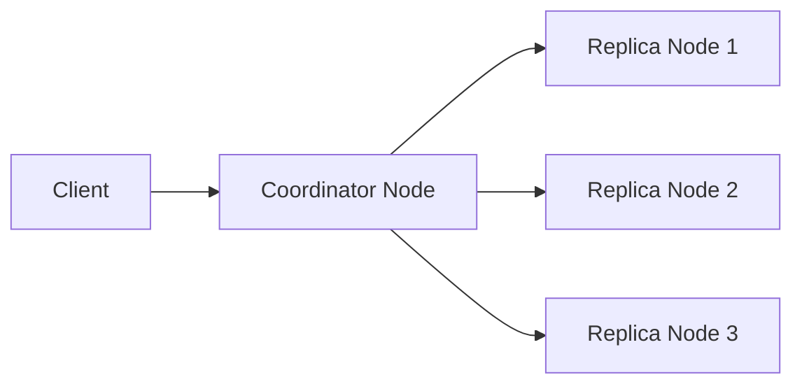
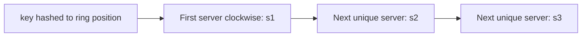
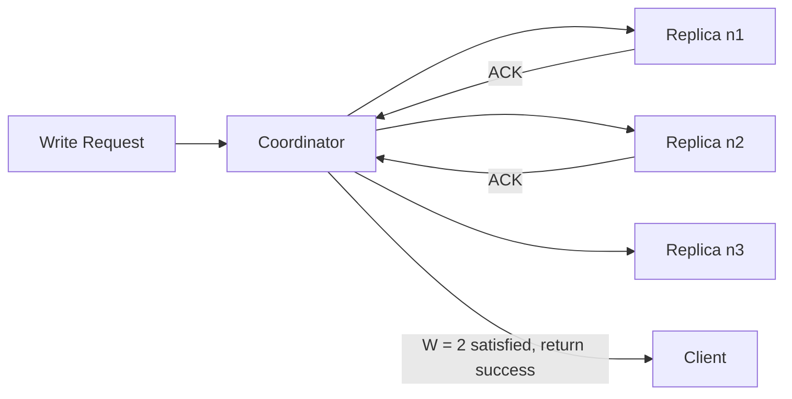
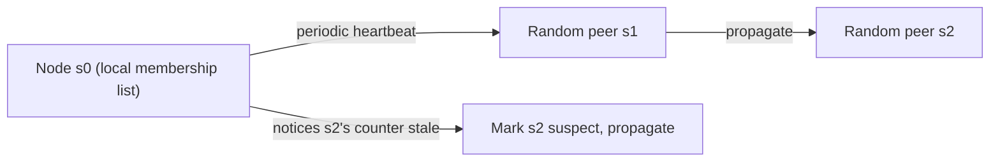
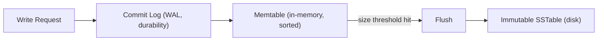
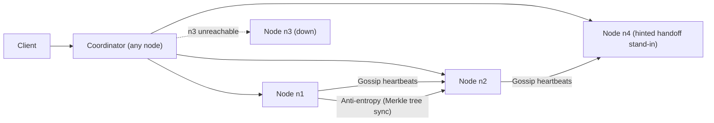

# Design a Distributed Key-Value Store
### Interview Prep — Amazon SDE III / Staff Engineer (L6)

---

## 1. Problem Statement

Design a distributed key-value store supporting:

```
put(key, value)   // insert/update "value" associated with "key"
get(key)          // retrieve "value" associated with "key"
```

At L6, the interviewer expects you to **drive the scoping conversation yourself** rather than wait to be told constraints. Open with clarifying questions before any design work.

### Clarifying questions to ask out loud
- What's the size range of a value? (Assume < 10 KB — this rules out a blob/object store design and confirms this is a small-record system like Dynamo, not S3.)
- Read-heavy, write-heavy, or balanced? (Changes your R/W quorum tuning.)
- Do we need strong consistency anywhere (e.g., financial data), or is eventual consistency acceptable everywhere?
- Single region or multi-region?
- Do we need range queries / scans, or pure point lookups by key? (Point lookups only — this justifies consistent hashing over range partitioning.)
- Expected scale — total keys, QPS, growth rate?

### Functional requirements
- `put(key, value)`, `get(key)` with low latency
- Data durability across node/rack/datacenter failures

### Non-functional requirements
- **High availability** — no single point of failure, system stays responsive during partial failures
- **High scalability** — horizontal scale-out, ideally automatic
- **Tunable consistency** — let the caller trade off latency vs. correctness
- **Low latency** — p99 in single-digit to low double-digit ms
- **Partition tolerance** — network partitions are a fact of life at this scale, so per CAP we are choosing between **AP** and **CP** per-operation (not globally) via tunable quorum

> **Staff-level framing point to say out loud:** "This isn't a CP-vs-AP binary choice for the whole system — with quorum-based consistency (N/W/R), we let each individual write/read choose its point on that spectrum. That's the Dynamo insight I want to build on."

---

## 2. Back-of-Envelope Estimation

State assumptions explicitly — the number matters less than showing you can reason from them.

| Assumption | Value |
|---|---|
| Total keys | 1 billion |
| Avg value size | 1 KB (well under the 10 KB cap) |
| Raw data size | 1B × 1 KB = **1 TB** |
| Replication factor (N) | 3 |
| Total storage with replication | 1 TB × 3 = **3 TB** |
| Read:Write ratio | 10:1 (typical KV workload — e.g. session/profile store) |
| Peak QPS | 100K reads/sec, 10K writes/sec |
| Single node disk capacity (usable) | ~500 GB – 1 TB (SSD, leaving headroom for compaction) |
| Minimum nodes for storage alone | 3 TB / 1 TB ≈ 3 — but scale out to tens/hundreds of nodes for load distribution, not just capacity |

> **Why this matters at L6:** the interviewer isn't grading the exact numbers — they're checking whether you connect estimation to design decisions later (e.g., "since we're read-heavy, I'll bias R low and W high," or "since values are small, in-memory memtables + SSTables are viable, we don't need a separate blob tier").

---

## 3. API Design

```
put(key, value) -> { status: "ok" | "error", version: VectorClock }
get(key)        -> { value, version: VectorClock }
                   | { siblings: [(value_i, version_i), ...] }  // on unresolved conflict
delete(key)     -> tombstone write (soft delete, same path as put)
```

Design notes to mention:
- `get` can return **multiple sibling versions** when eventual consistency has produced a conflict — the client (or a reconciliation layer) resolves it. This is a deliberate API decision, not an oversight — surfacing conflicts to the caller is how Dynamo-style systems maintain availability during partitions.
- `delete` is implemented as a tombstone write, not a physical delete, so it can propagate correctly through replication and anti-entropy (physical deletion happens later via compaction/GC).

---

## 4. Data Model / Schema

This is a schemaless KV store, so "schema" here means the **on-disk record format** and **cluster metadata**, not a relational schema.

**Per-record entry (in memtable / SSTable):**
| Field | Purpose |
|---|---|
| `key` | partitioning + lookup key |
| `value` | opaque blob, ≤ 10 KB |
| `vector_clock` | list of (node_id, counter) pairs for conflict detection |
| `timestamp` | write time, used as tiebreak / TTL / compaction ordering |
| `tombstone` | boolean flag for soft deletes |

**Cluster metadata (held by every node via gossip):**
| Field | Purpose |
|---|---|
| `node_id` | member identity |
| `heartbeat_counter` | liveness signal for gossip protocol |
| `status` | up / suspected-down / down |
| `virtual_node_tokens[]` | positions this physical node owns on the hash ring |

**Per-key replication metadata:**
| Field | Purpose |
|---|---|
| `preference_list` | ordered list of N node IDs responsible for this key (first N *unique physical* nodes walking clockwise from the key's ring position) |

---

## 5. High-Level Architecture (v1)



Every node can act as a coordinator for any request it receives — there's no dedicated proxy tier and no single point of failure. This is a deliberate architectural choice: **full decentralization**.

---

## 6. Data Partitioning — Consistent Hashing (v2)



- Servers and keys are hashed onto the same ring (0 to 2^n−1).
- A key is owned by the first server encountered walking clockwise.
- **Virtual nodes**: each physical server is assigned many points on the ring, proportional to its capacity — this gives even load distribution and lets heterogeneous hardware participate (a bigger box gets more virtual nodes).
- Adding/removing a node only reshuffles the keys adjacent to it on the ring — **O(K/N) keys move**, not the whole dataset. This is the property that makes autoscaling feasible.

---

## 7. Replication (v3)



- Data for a key is replicated to the **N** nodes in its preference list.
- Replicas are spread across distinct racks/datacenters where possible, since correlated failures (power, network) tend to take down a whole rack/DC at once.

---

## 8. Consistency — Quorum (N, W, R)

| Symbol | Meaning |
|---|---|
| N | total replicas |
| W | write quorum — write succeeds once W replicas ACK |
| R | read quorum — read succeeds once R replicas respond |

- **W + R > N** ⇒ strong consistency (guaranteed overlap between the replica sets touched by the last write and any subsequent read)
- **W + R ≤ N** ⇒ eventual consistency, but lower latency
- Typical production tuning: **N = 3, W = R = 2**
- **R = 1, W = N** → optimized for fast reads (read-heavy workload, e.g. our 10:1 estimate above)
- **W = 1, R = N** → optimized for fast writes

> **Say this explicitly in the interview:** "Given our 10:1 read:write ratio from the estimation, I'd bias toward R=1/W=N or at least R < W, since reads dominate and we want them fast — writes can absorb a bit more latency."

---

## 9. Conflict Resolution — Vector Clocks

Walkthrough to have ready (interviewers often ask you to trace this):

1. Client writes `D1` via server `Sx` → clock `D1[(Sx,1)]`
2. Client reads `D1`, updates to `D2`, written via `Sx` again → `D2[(Sx,2)]` (descendant, no conflict)
3. Client reads `D2`, updates to `D3` via `Sy` → `D3[(Sx,2),(Sy,1)]`
4. **Concurrently**, another client reads `D2`, updates to `D4` via `Sz` → `D4[(Sx,2),(Sz,1)]`
5. A later reader fetches both `D3` and `D4` — neither dominates the other (Sy's counter is missing from D4's clock and vice versa) → **conflict detected**, both siblings returned to the caller for reconciliation
6. Reconciled write `D5[(Sx,3),(Sy,1),(Sz,1)]` supersedes both

**Ancestor rule:** X is an ancestor of Y if every counter in X's clock is ≤ the corresponding counter in Y's clock.
**Sibling (conflict) rule:** if any counter in Y is less than the corresponding counter in X, they conflict.

**Known downside to mention proactively:** vector clocks can grow unbounded with many concurrent writers. Production systems cap the length and evict the oldest `(node, counter)` pairs, trading perfect conflict detection for bounded metadata size.

---

## 10. Failure Handling

### Detection — Gossip Protocol

- Decentralized, O(1) load per node vs. all-to-all multicast's O(N²).
- Requires **at least two independent confirmations** before marking a node down — avoids false positives from one node's transient network hiccup.

### Temporary failures — Sloppy Quorum + Hinted Handoff
- Instead of blocking on a strict quorum of the "correct" N nodes, use the **first W/R healthy nodes** on the ring, skipping down nodes.
- The stand-in node holds a "hint" and hands the data back once the original node recovers.
- Trade-off to name explicitly: this improves availability but temporarily weakens the W+R>N consistency guarantee, since the write may not have landed on the "real" preference list nodes yet.

### Permanent failures — Anti-Entropy via Merkle Trees
- Compare replicas by walking down from root hash; only recurse into subtrees whose hashes differ.
- Synchronization cost becomes proportional to the **difference** between replicas, not the full dataset size — critical at billion-key scale.

### Datacenter outage
- Replicas placed across DCs so a full DC loss still leaves N−1 (or more) reachable copies.

---

## 11. Node-Local Storage Engine — Write Path (v4)



This is an **LSM-tree** design (same family as Cassandra/HBase/RocksDB), not a B-tree. Sequential writes to the WAL + memtable make writes cheap; SSTables are periodically compacted to bound read amplification and reclaim tombstoned space.

## 12. Node-Local Storage Engine — Read Path (v4)


Bloom filters give a cheap, probabilistic "definitely not here" check per SSTable, avoiding disk I/O against tables that can't contain the key (false positives are possible, false negatives are not).

---

## 13. Full System Architecture (v5 — everything together)



---

## 14. Deep-Dive Decision Rationale

> **Why consistent hashing over static range partitioning?**
> Range partitioning is simpler but creates hot spots on sequential or skewed key access and requires manual re-sharding. Consistent hashing bounds data movement to O(K/N) on membership changes and, combined with virtual nodes, spreads load evenly across heterogeneous hardware — which is what "automatic scaling" in the requirements actually demands.

> **Why quorum-based tunable consistency over a single global consistency model?**
> A one-size-fits-all strong-consistency system (block until all replicas agree) sacrifices availability during partitions, which directly violates the "high availability" requirement. Exposing N/W/R as tunable parameters lets each caller/use-case pick its point on the latency-vs-consistency curve without forking the system.

> **Why vector clocks over last-write-wins (LWW) timestamps?**
> LWW is simpler and avoids client-side reconciliation, but silently drops concurrent writes based on clock skew — unacceptable when both concurrent updates are meaningful (e.g., two shopping-cart additions). Vector clocks make concurrency **detectable** rather than silently resolved, at the cost of client complexity and unbounded metadata growth (mitigated by capping clock length).

> **Why gossip-based failure detection over a centralized heartbeat monitor?**
> A centralized monitor is a single point of failure and a bottleneck at scale (all-to-all is O(N²) messages). Gossip is decentralized, converges in O(log N) rounds, and degrades gracefully — consistent with the "no single point of failure" architectural principle already chosen for partitioning.

> **Why an LSM-tree (memtable + SSTable) storage engine over a B-tree?**
> Our workload is write-optimized at the storage-engine layer (sequential WAL append + in-memory buffering) even though the overall access pattern is read-heavy at 10:1 — because random-write B-tree updates on spinning/SSD media are far more expensive than sequential appends plus batched, sorted flushes. Bloom filters and block caches recover read performance without sacrificing write throughput.

> **Why Merkle trees for anti-entropy instead of comparing full datasets?**
> At billion-key scale, transferring or hashing the entire dataset to detect drift between replicas is infeasible. Merkle trees let two nodes agree on where they diverge in O(log K) comparisons and only transfer the differing buckets — turning "permanent failure recovery" into a cost proportional to the *delta*, not the *dataset*.

---

## 15. Follow-Up Questions an L6 Interviewer Will Push On

**"How do you handle a hot key that's getting 100x normal traffic?"**
Add a per-key read cache in front of the coordinator; for extreme cases, replicate the hot key beyond N (over-replication) or shard it artificially via key salting (`key#0`, `key#1`, ... fanned out and merged on read) so no single physical node absorbs all the traffic.

**"How would you add range queries / scans on top of this?"**
Consistent hashing scatters lexically adjacent keys across the ring, so native range scans aren't possible. You'd need either: (a) a secondary, range-partitioned index maintained asynchronously, or (b) accept that range queries fall outside this system's design goals and belong in a different storage layer (this is the same reasoning DynamoDB's designers made — pure KV, with separate query/index features layered on top).

**"How does this compare to how DynamoDB is actually built?"**
This design tracks the original 2007 Dynamo paper closely (consistent hashing, vector clocks, sloppy quorum, Merkle trees, gossip). Production DynamoDB has evolved further — e.g. it replaced client-exposed vector-clock conflict resolution with server-side timestamp-based reconciliation for simplicity, added adaptive capacity and on-demand scaling, and built global tables for multi-region active-active replication.

**"Multi-region active-active — what breaks?"**
Cross-region quorum writes add tens to hundreds of ms of latency, so most designs relax to per-region quorum with asynchronous cross-region replication (accepting a wider eventual-consistency window and more frequent siblings needing reconciliation).

**"How would you validate the eventual-consistency guarantees actually hold before shipping this?"**
Fault-injection / chaos testing (kill nodes, partition the network, delay messages) combined with a linearizability/consistency checker (Jepsen-style) run continuously against the write/read quorum paths — this is the kind of validation step a staff-level answer is expected to volunteer, not just describe the happy path.

**"Vector clocks are growing unbounded in production — what do you do?"**
Cap the clock at a fixed length and evict oldest `(node, counter)` entries (accepting occasional false-conflict detection), or migrate toward dotted version vectors / CRDTs, which bound metadata growth more gracefully for high-concurrency keys.

---

## 16. Component Cheat Sheet

| Goal / Problem | Technique |
|---|---|
| Store data at scale across many servers | Consistent hashing |
| Minimize data movement on scale up/down | Consistent hashing (O(K/N) reshuffle) |
| Handle heterogeneous server capacity | Virtual nodes |
| High-availability reads | Data replication, multi-DC placement |
| High-availability writes | Vector clocks + client-side conflict reconciliation |
| Tunable consistency | Quorum consensus (N, W, R) |
| Temporary node failure | Sloppy quorum + hinted handoff |
| Permanent node failure / replica drift | Anti-entropy via Merkle trees |
| Datacenter outage | Cross-datacenter replication |
| Fast, sequential writes | LSM-tree: WAL → memtable → SSTable |
| Fast reads without scanning every SSTable | Bloom filters |
| Decentralized failure detection | Gossip protocol |

---

## 17. Suggested Interview Time Allocation (45–60 min)

| Phase | Time | Focus |
|---|---|---|
| Requirements & scoping questions | 5 min | Drive the clarifying questions yourself |
| Back-of-envelope estimation | 5 min | Tie numbers to later decisions (R/W bias, storage engine choice) |
| High-level architecture + API | 10 min | Decentralized coordinator model, put/get/delete signatures |
| Deep dive #1: partitioning + replication | 10 min | Consistent hashing, virtual nodes, N/W/R quorum |
| Deep dive #2: consistency + conflict resolution | 10 min | Vector clocks with a live trace-through example |
| Deep dive #3: failure handling | 10 min | Gossip, sloppy quorum/hinted handoff, Merkle trees |
| Wrap-up trade-offs + follow-ups | 5-10 min | Be ready to volunteer the DynamoDB comparison and hot-key handling unprompted |
